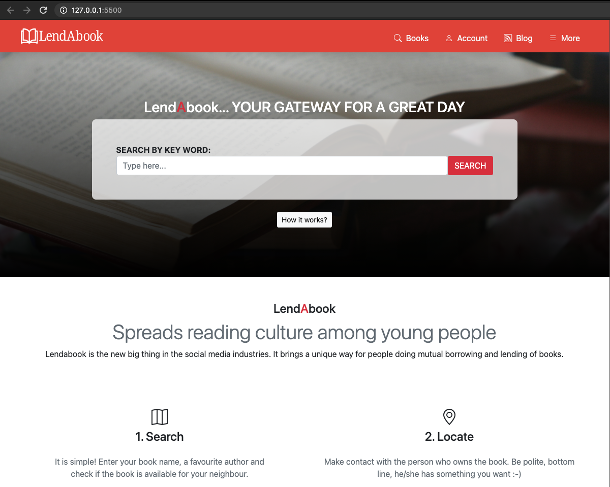
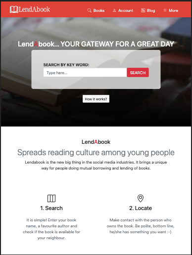
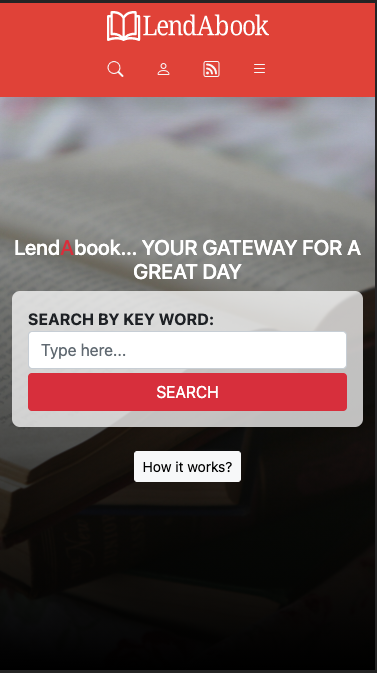

# Capstone Project - LendAbook

> LendAbook directory. Books and book owners directory, a service offering of borrowing and lending books online!

## This project covers the following features

- The main page, where you can find books of your desire which is available to borrow.
- Result page, what we saw and listing of similar books or books related to a specific author
- On the detail page, each book has information about lander and availability.

## Built With

- HTML
- SCSS/css

## Live Demo

[Live Demo Link](https://marijanbrvar.github.io/LendABook/)

### Setup

Pure HTML CSS no need for additional configuration or seting up. You can simpy run from file.

### Install

No instaltaion required

### Run tests

For HTML use npx hint .
For SCSS Lint use npx **/*.scss

### Deployment

Clone directory using GitHub, I was using GoLive for VSCode, but you can run by opening the file in your browser as well! Live preview available at [Link](https://marijanbrvar.github.io/CoffeeToGo/)

## Authors

👤 **Marijan Brvar**

- GitHub: [@githubhandle](https://github.com/marijanbrvar)
- Twitter: [@twitterhandle](https://twitter.com/marijanbrvar)
- LinkedIn: [LinkedIn](https://linkedin.com/in/marijanbrvar)
- 

## 🤝 Contributing

Contributions, issues, and feature requests are welcome!

Feel free to check the [issues page](https://github.com/marijanbrvar/CoffeeToGo/issues).

## Show your support

Give a ⭐️ if you like this project!

## Acknowledgments

- Design idea by [Mathew Njuguna and others on Behance](https://www.behance.net/mathewnjuguna)
- Base layout: [link](https://www.behance.net/gallery/25563385/PatashuleKE)

## 📝 License

<!-- This project is [MIT](lic.url) licensed. -->
Shield: [![CC BY-SA 4.0][cc-by-sa-shield]][cc-by-sa]

This work is licensed under a
[Creative Commons Attribution-ShareAlike 4.0 International License][cc-by-sa].

[![CC BY-SA 4.0][cc-by-sa-image]][cc-by-sa]

[cc-by-sa]: http://creativecommons.org/licenses/by-sa/4.0/
[cc-by-sa-image]: https://licensebuttons.net/l/by-sa/4.0/88x31.png
[cc-by-sa-shield]: https://img.shields.io/badge/License-CC%20BY--SA%204.0-lightgrey.svg
